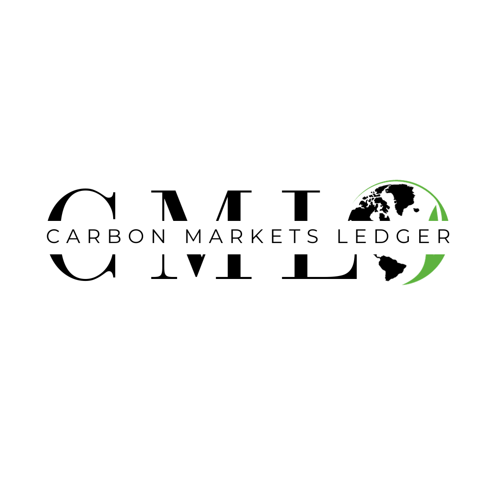

# SOLANA_HYPERDRIVE_CLIENT

## Introduction

The escalating concerns surrounding climate change have led to the advent of carbon markets, designed to incentivize emissions reductions. Despite their potential, the effectiveness of carbon markets is currently being undermined by fragmented registries, lack of transparency, and cumbersome verification and trading procedures. The Carbon Markets Ledger project proposes a novel, blockchain-based solution to unify the carbon credits platform through a process of tokenization, thus addressing the prevailing issues and enhancing the global impact of carbon markets.

## Problem Statement

1. **Fragmented Registries**:

    - Disparate regional and sectoral registries, each adhering to varying standards, impede the seamless verification and trading of carbon credits across borders.

2. **Transparency Deficit**:

    - The absence of a centralized, transparent database fosters distrust among stakeholders, deterring market participation.

3. **Verification and Trading Bottlenecks**:

    - Manual verification processes are slow, error-prone, and scale poorly with market growth, obstructing efficient trading and verification of carbon credits.

4. **Inconsistent Data Reporting**:
    - Diverging data reporting standards further complicate the verification process, undermining the market’s integrity.

## Proposed Solution: Unified Tokenization Platform

### Tokenization

-   Utilizing robust token standards on the Solana blockchain to tokenize carbon credits, making each credit unique, traceable, and tradable on a unified platform.

### Blockchain Integration

-   The immutable, transparent ledger of blockchain technology revolutionizes the recording and verification of carbon credit transactions, enhancing transparency and trust in the market.

### Smart Contracts

-   Automation of verification and transactions through smart contracts eliminates manual errors, speeds up processes, and ensures compliance with predefined rules, significantly improving market efficiency.

### Global Standardization

-   Adoption of a universal standard for carbon credit tokenization to foster global consistency, interoperability, and ease of verification.

## Unique Value Proposition

-   A one-stop solution for tokenizing, verifying, and trading carbon credits globally, enhancing transparency, efficiency, and cost-effectiveness, while facilitating consistent data reporting and verification.

## Target Audience

-   Carbon Credit Registries, Environmental Agencies, Governments, Businesses, and Investors.

## System Architecture

## Solana's Key Role

Solana's high-performance blockchain provides the underlying infrastructure for the Carbon Markets Ledger platform. It enables the fast, secure, and scalable tokenization of carbon credits. The utilization of Solana's blockchain technology ensures that every carbon credit transaction is traceable and irreversible, thereby significantly enhancing transparency and trust in the carbon credits market.

## Data Storage

Data within the Carbon Markets Ledger platform is stored securely utilizing AWS services. AWS’s robust infrastructure provides a reliable and scalable solution for hosting, managing, and accessing data essential for the operation of the tokenization platform.

-   **Storage**: AWS services like Amazon S3 provide durable, secure, and scalable storage solutions for a wide range of data types.
-   **Hosting**: AWS's hosting solutions ensure that the platform remains accessible, with high availability and low latency.

## Contract Links

-   **Project Data On-chain Contract**: [View Contract](https://explorer.solana.com/address/BfE5siVdPnnezakBy37mvVABQfSCNZyoijLZFmxzjoDu?cluster=devnet)

## Backend Repository

The backend and smart contracts integration for this project were developed in a separate repository:

-   Backend Repository: [SOLANA_HYPERDRIVE_SERVER Repository](https://github.com/mike-mwangi/SOLANA_HYPERDRIVE_SERVER)

## Live Platform and Pitch Deck
-   Live Platform: [Carbon Markets Ledger Live Platform](https://carbonmarketsledger.verst.earth/)

-   Pitch Deck: [Carbon Markets Ledger Pitch Deck](https://www.canva.com/design/DAFxUMtaUG4/c8Mr5Jeep9lBpXNsaj_09w/view?utm_content=DAFxUMtaUG4&utm_campaign=designshare&utm_medium=link&utm_source=editor)

-   Pitch Video and System Demo: [Carbon Markets Ledger Pitch Video](https://youtu.be/s0UMiA5HSRs?si=nnDfQs_OlJB1JPzi)

## Version 2.0 Roadmap

As we forge ahead, our commitment to enhancing the Carbon Markets Ledger platform and maximizing its impact is unwavering. Here's a sneak peek into the future developments planned for the next iteration of the Carbon Markets Ledger:

1. **Automated Data Integration**:
    - Recognizing the intricacies of managing data across multiple registries, we are on the brink of devising APIs designed to interact with these registries. This will facilitate automated querying and data population, simplifying the process for stakeholders and ensuring up-to-date, comprehensive information is always at their fingertips.

2. **Data Sharing Endpoints**:
    - As we aim to establish ourselves as a universal carbon market hub, we intend to provide endpoints that various technology providers, including fintech firms, market analysts, and data aggregators, can plug into. This will usher in a new era of data consumption, where access to carbon project data is seamless, fostering innovation and market transparency.

3. **Enhanced Analytics for Carbon Markets**:
    - Knowledge is power. To supercharge the decision-making processes of stakeholders, we plan to roll out sophisticated data analytics tools. These tools will not only present insights on carbon market trends but also provide a bird's-eye view of our environment's health, enabling proactive measures for its protection.

4. **Collaboration with Governments for Compliance Markets**:
    - National governments are integral players in the carbon market dynamics. Our platform will be tailored to assist governments in monitoring and enhancing compliance markets at the national level. By providing a streamlined approach to data access and reporting, we aim to optimize the regulatory framework, ensuring environmental objectives are met effectively and efficiently.

Our roadmap embodies our relentless pursuit of excellence, innovation, and global impact. As we journey together into this promising future, we invite our stakeholders to share their insights, ensuring our platform continues to evolve in sync with the needs of the carbon markets ecosystem.

## Conclusion

The Carbon Markets Ledger project endeavors to eliminate the existing barriers in global carbon markets by leveraging the prowess of blockchain technology and asset tokenization. By significantly streamlining the verification and trading processes of carbon credits, this venture aligns with global sustainability aspirations and is poised to deliver both economic and environmental dividends on a global scale.
